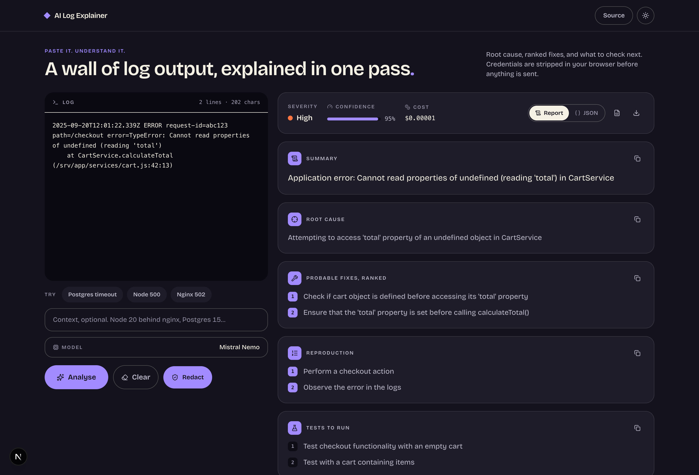

# AI Log Explainer

Paste a stack trace, an nginx error, or a wall of application log output, and get
back the root cause, a ranked list of probable fixes, how to reproduce it, and
what to test once you have fixed it.

Anything that looks like a credential is stripped **in the browser**, before the
log is sent anywhere.



## What it does

- **Structured answer, not a paragraph.** The model is constrained to return
  JSON: summary, root cause, ranked fixes, reproduction steps, follow-up tests,
  severity, confidence, and a task list.
- **Streams while it thinks.** The backend relays tokens over SSE, so the
  analysis appears as it is written rather than after a blank thirty seconds.
  If the streaming route is unavailable it falls back to a single request.
- **Redaction before transmission.** API keys, bearer tokens, JWTs, long hex
  strings and email addresses are masked client-side. On by default.
- **Exports.** Download the analysis as JSON or as a Markdown report.
- **Drag a log file in**, or start from one of three built-in samples.
- **Pick the model, see the bill.** Twelve models from free to frontier, and
  each answer shows what it actually cost, including the reasoning tokens you
  paid for but never saw.

## Running it

You need an [OpenRouter](https://openrouter.ai/keys) API key with a little
credit on it. The default model is `mistralai/mistral-nemo`, which costs about
$0.00003 per analysis, so a thousand of them runs to roughly seven cents.

The picker does list two free models, but they are a courtesy rather than the
default: OpenRouter withdrew the three `:free` slugs this project originally
shipped with, and free slugs also rate limit under load.

```bash
cp backend/.env.example backend/.env   # then paste your key into it
./run.sh                               # starts the API on :8000 and the UI on :3000
```

`run.sh` creates the virtualenv, installs both halves, and runs them together.

<details>
<summary>Running the two halves separately</summary>

```bash
# API
python3 -m venv .venv && ./.venv/bin/pip install -r backend/requirements.txt
cd backend && ../.venv/bin/uvicorn app.main:app --reload --port 8000

# UI
cd ai-log-ui && npm install && npm run dev
```

Swagger is at `http://127.0.0.1:8000/docs`.
</details>

## API

| Route | Method | Body | Returns |
|---|---|---|---|
| `/health` | GET | | `{ status: "ok" }` |
| `/models` | GET | | `{ models, default }` |
| `/explain` | POST | `{ raw_log, context?, model? }` | `{ raw_llm, parsed, usage }` |
| `/explain/stream` | POST | `{ raw_log, context?, model? }` | SSE: `status`, `chunk`, `final`, `error` |

`model` must be one of the ids from `/models`. The allowlist lives in
`config.MODEL_CHOICES`: without it the endpoint would be an open proxy to any
model on the key's credit.

`usage` carries OpenRouter's own accounting, so `cost` is the charge rather
than an estimate from a price table:

```json
{ "model": "openai/gpt-4o-mini", "prompt_tokens": 312, "completion_tokens": 688,
  "reasoning_tokens": null, "total_tokens": 1000, "cost": 0.00046 }
```

`parsed` is the model's JSON when it can be recovered from the response, and
`null` when it cannot. The UI renders `parsed` when present and falls back to
showing `raw_llm`.

## Configuration

Everything lives in `backend/.env`; see `backend/.env.example`.

| Variable | Default | |
|---|---|---|
| `OPENROUTER_API_KEY` | — | required |
| `DEFAULT_MODEL` | `mistralai/mistral-nemo` | the model the picker opens on |
| `MAX_TOKENS` | `4000` | reasoning models spend part of this thinking |
| `TEMPERATURE` | `0.0` | deterministic by default, since this is diagnosis |
| `FRONTEND_URL` | `http://localhost:3000` | for CORS |

The frontend reads `NEXT_PUBLIC_API_URL`, defaulting to `http://localhost:8000`.

## Layout

```
backend/
  app/
    main.py       routes, including the SSE stream
    prompts.py    the system prompt and the JSON contract it demands
    schemas.py    request and response models
    utils.py      pulls JSON back out of a chatty model response
    config.py     env loading, fails fast when the key is missing
  test_smoke.py
ai-log-ui/
  app/page.tsx    the whole interface
  app/globals.css design tokens, authored in OKLCH
```

## Tests

```bash
cd backend && ../.venv/bin/python -m pytest -q
```

## Notes

Python 3.12, FastAPI on Pydantic v2, Next.js 15 with the App Router, and
Tailwind v4. Type is [Bricolage Grotesque](https://fonts.google.com/specimen/Bricolage+Grotesque);
icons are [Lucide](https://lucide.dev).

Built by [Hussain Nawaz](https://hussainnawaz.vercel.app).
